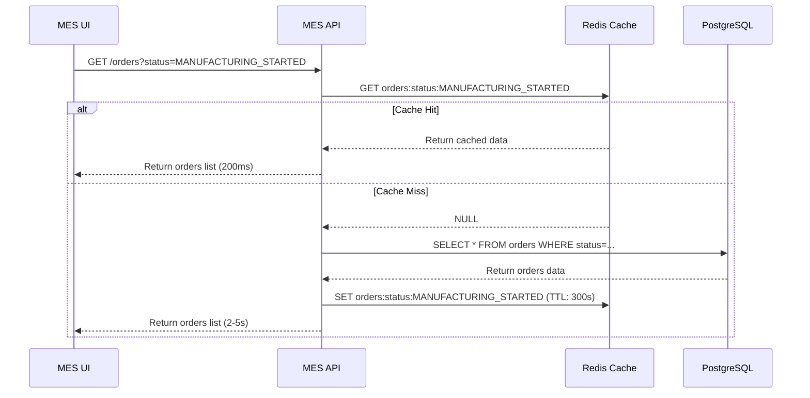
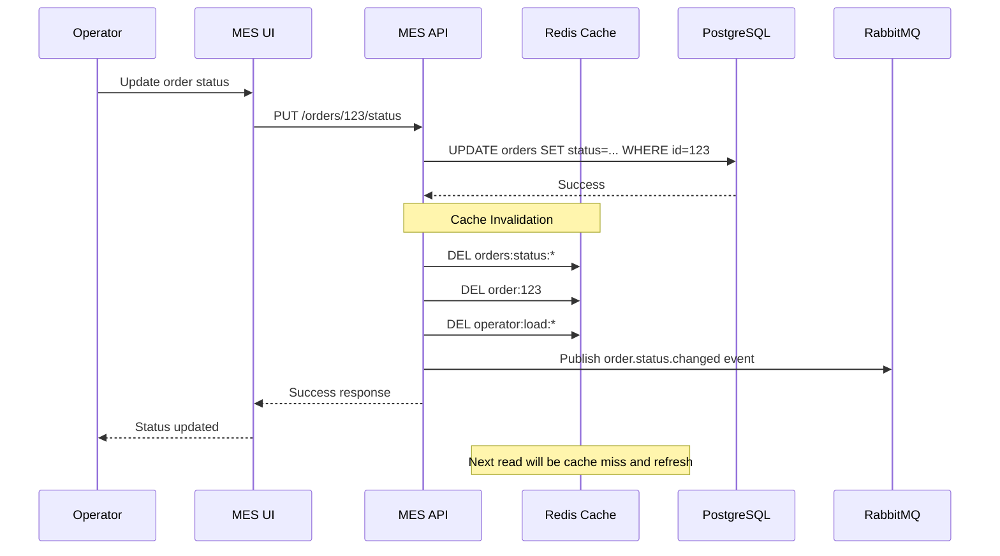

# Архитектурное решение по кешированию

## Анализ системы и проблемных областей

### Выявленные проблемы производительности

**1. MES Dashboard - критическая проблема:**
- Медленная загрузка первой страницы с заказами
- Операторы видят список заказов в работе по статусам
- Фильтрация и пагинация не решили проблему
- Операторам важно видеть самые новые заказы (влияет на зарплату)

**2. MES API - проблемы масштабирования:**
- Расчет стоимости занимает 2-30 минут
- API используется внешними партнерами (B2B)
- Рост нагрузки после открытия API
- Жалобы партнеров на производительность

**3. Интеграционные узкие места:**
- RabbitMQ очереди под высокой нагрузкой
- Множественные запросы к базе данных
- Отсутствие кеширования результатов

### Области для кеширования

**Приоритет 1 - MES Dashboard:**
- ✅ Список заказов по статусам
- ✅ Фильтры и метаданные заказов
- ✅ Информация об операторах
- ✅ Статистика по заказам

**Приоритет 2 - MES API:**
- ✅ Результаты расчета стоимости
- ✅ Метаданные 3D файлов
- ✅ Справочные данные (материалы, операторы)
- ✅ Часто запрашиваемые заказы

**Приоритет 3 - CRM и Shop:**
- ✅ Информация о клиентах
- ✅ Справочники (статусы, категории)
- ✅ Конфигурационные данные

## Мотивация

### Почему необходимо внедрить кеширование

**Текущие проблемы:**
- **Низкая производительность MES Dashboard** - операторы теряют время и деньги
- **Медленный API для партнеров** - риск потери B2B контрактов
- **Высокая нагрузка на базы данных** - приближение к limits
- **Дублированные вычисления** - один расчет стоимости может повторяться многократно

**Проблемы, которые решит кеширование:**

**1. Производительность MES Dashboard:**
- Время загрузки списка заказов: с 5-10 секунд до 200-500ms
- Фильтрация и сортировка: мгновенные результаты
- Обновления в реальном времени без полной перезагрузки

**2. Оптимизация MES API:**
- Кеширование результатов расчета стоимости
- Быстрые ответы для повторных запросов
- Снижение нагрузки на вычислительные ресурсы

**3. Масштабируемость системы:**
- Снижение нагрузки на базы данных на 70-80%
- Возможность обслуживать больше одновременных пользователей
- Улучшенная отзывчивость под пиковой нагрузкой

**Элементы системы для кеширования:**

**MES система:**
- Список активных заказов (группировка по статусам)
- Результаты поисковых запросов
- Метаданные операторов и их загрузка
- Результаты расчета стоимости изделий

**Интеграционный слой:**
- Сессии и состояния пользователей
- Справочные данные (статусы, категории)
- Результаты API вызовов между системами

**Файловая система:**
- Метаданные 3D файлов
- Превью изображений
- Часто запрашиваемые файлы

### Ожидаемые результаты

**Технические метрики:**
- Response time MES Dashboard: с 5-10 сек до 200-500ms
- Database load: снижение на 70-80%
- API throughput: увеличение в 3-5 раз
- Cache hit ratio: 85-90% для частых запросов

**Бизнес-метрики:**
- Производительность операторов: +30-40%
- Удовлетворенность B2B партнеров: улучшение SLA
- Capacity для роста: +200% без дополнительного железа
- Снижение жалоб на производительность: -80%

## Предлагаемое решение

### Выбор типа кеширования

**Серверное кеширование** - основной подход

**Обоснование:**
✅ **Централизованное управление** - единая точка инвалидации
✅ **Снижение нагрузки на БД** - главная цель
✅ **Консистентность данных** - контроль обновлений
✅ **Масштабируемость** - один кеш для всех клиентов
✅ **Безопасность** - нет чувствительных данных на клиенте

**Клиентское кеширование** - дополнительный уровень

**Применение:**
- HTTP кеш-заголовки для статичных ресурсов
- Browser cache для JS/CSS/изображений
- Session storage для пользовательских фильтров
- Local storage для пользовательских настроек

### Выбор паттерна кеширования

**Cache-Aside (Lazy Loading) - основной паттерн**

**Обоснование выбора:**
✅ **Простота реализации** - минимальные изменения в коде
✅ **Отказоустойчивость** - система работает при падении кеша
✅ **Гибкость** - кешируем только то, что нужно
✅ **Совместимость** - легко интегрируется с существующим кодом

**Почему не другие паттерны:**

**Write-Through:**
❌ Увеличивает latency записи
❌ Кеширует данные, которые могут не читаться
❌ Сложнее для частично обновляемых данных

**Write-Behind:**
❌ Риск потери данных при сбоях
❌ Сложность реализации консистентности
❌ Не подходит для критичных бизнес-данных

**Refresh-Ahead:**
❌ Сложность прогнозирования нагрузки
❌ Может кешировать неактуальные данные
❌ Требует сложной логики предзагрузки

### Технологический стек

**Redis Cluster** - основное решение для кеширования
- **Производительность**: sub-millisecond latency
- **Масштабируемость**: горизонтальное масштабирование
- **Отказоустойчивость**: репликация и failover
- **Типы данных**: strings, hashes, lists, sets, sorted sets


### Диаграмма последовательности

#### Операция чтения списка заказов



#### Операция изменения статуса заказа



### Стратегия инвалидации кеша

**Гибридная стратегия** - комбинация подходов

**1. Программная инвалидация (основная):**
```python
# При изменении заказа
def update_order_status(database, cache, order_id, old_status, new_status, operator_id):
    # Обновляем БД
    database.update_order(order_id, new_status)
    
    # Инвалидируем связанные ключи
    cache.delete(f"order:{order_id}")
    cache.delete(f"orders:status:{old_status}")
    cache.delete(f"orders:status:{new_status}")
    cache.delete(f"operator:load:{operator_id}")
    cache.delete_pattern("orders:search:*")
```

**2. Временная инвалидация (TTL):**
- **Справочные данные**: 1 час (статусы, категории)
- **Списки заказов**: 5 минут (баланс между производительностью и актуальностью)
- **Пользовательские сессии**: 30 минут
- **Результаты расчета стоимости**: 24 часа (меняются редко)

**3. Event-driven инвалидация:**
```yaml
# RabbitMQ события для инвалидации
events:
  - event: "order.status.changed"
    invalidate: ["orders:status:*", "order:{order_id}"]
    
  - event: "order.created" 
    invalidate: ["orders:status:INITIATED", "orders:search:*"]
    
  - event: "operator.assigned"
    invalidate: ["operator:load:*", "orders:unassigned"]
```

**Обоснование выбора стратегии:**

**Программная инвалидация:**
✅ **Точность** - инвалидируем только то, что изменилось
✅ **Консистентность** - гарантируем актуальность данных
✅ **Контроль** - полный контроль над жизненным циклом

**Временная инвалидация (TTL):**
✅ **Защита от stale data** - автоматическая очистка
✅ **Простота** - не требует сложной логики
✅ **Отказоустойчивость** - работает при сбоях инвалидации

**Event-driven инвалидация:**
✅ **Масштабируемость** - работает в распределенной системе
✅ **Loose coupling** - системы не зависят друг от друга
✅ **Async обработка** - не влияет на основной flow

**Почему не другие стратегии:**

**Только TTL:**
❌ Может показывать устаревшие данные
❌ Неэффективно для часто меняющихся данных
❌ Сложно настроить оптимальное время

**Только программная:**
❌ Риск забыть инвалидировать ключ
❌ Сложность при изменении схемы кеширования
❌ Нет защиты от багов в коде

**Manual инвалидация:**
❌ Не масштабируется
❌ Человеческий фактор
❌ Не подходит для автоматизированных процессов

### Ключевые решения по кешированию

**Структура ключей Redis:**
```
# Заказы
order:{order_id}                    # Детали заказа
orders:status:{status}              # Список заказов по статусу
orders:operator:{operator_id}       # Заказы оператора
orders:search:{hash_of_filters}     # Результаты поиска

# Операторы  
operator:{operator_id}              # Информация об операторе
operator:load:{operator_id}         # Загрузка оператора
operators:active                    # Список активных операторов

# Справочники
dict:statuses                       # Справочник статусов
dict:materials                      # Справочник материалов
dict:categories                     # Справочник категорий

# Расчеты стоимости
price:calc:{file_hash}              # Результат расчета
price:queue:{calculation_id}        # Статус расчета в очереди
```

**Cache warming стратегия:**
- Предзагрузка справочников при старте приложения
- Warm up кеша популярных запросов в фоновом режиме
- Постепенное заполнение кеша реальными пользовательскими запросами

**Мониторинг кеширования:**
- Cache hit/miss ratio по ключам
- Memory usage и eviction statistics  
- Latency metrics для cache операций
- Business metrics: response time улучшения

### Архитектурные изменения

**Новые компоненты:**
🔴 **Redis Cluster** (3 master + 3 replica nodes)
🔴 **Cache Service Layer** в каждом приложении
🔴 **Cache Invalidation Service** для event-driven инвалидации
🔴 **Cache Monitoring Dashboard**

**Изменения в существующих компонентах:**
- MES API: интеграция с Redis, cache-aside pattern
- MES UI: browser caching headers
- CRM API: кеширование справочников
- RabbitMQ: события для инвалидации кеша

**Новые связи:**
- Все API сервисы ↔ Redis Cluster
- Cache Invalidation Service ↔ RabbitMQ
- Monitoring Dashboard ↔ Redis metrics

## План внедрения

**Фаза 1 (2 недели): Инфраструктура**
- Развертывание Redis Cluster
- Базовая интеграция с MES API
- Кеширование справочников

**Фаза 2 (2 недели): MES Dashboard**  
- Кеширование списков заказов
- Оптимизация поисковых запросов
- Инвалидация при изменениях

**Фаза 3 (2 недели): Расширенное кеширование**
- Результаты расчета стоимости  
- CRM интеграция
- Event-driven инвалидация

**Фаза 4 (1 неделя): Мониторинг и оптимизация**
- Настройка мониторинга
- Тюнинг TTL и eviction policies
- Обучение команды

**Общее время: 7 недель**

**Критерии успеха:**
- MES Dashboard загружается < 500ms
- Cache hit ratio > 85%
- Database load снижена на 70%
- Жалобы операторов на производительность = 0